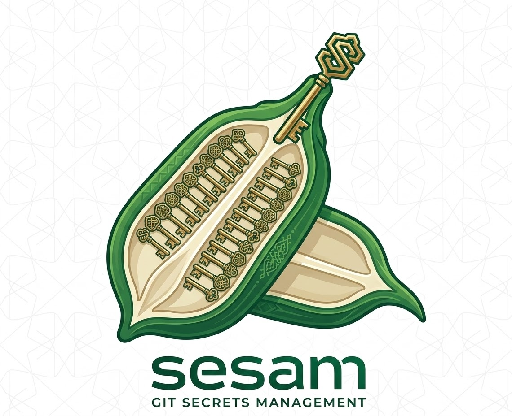

# We are trying to build an alternative to git-secret

## Requirements

- Tool written in Golang
- Dependent only on git
- Easy and safe to use (make it hard to shoot yourself in the foot)
- Encrypting/decrypting
- user management
- Leveled access
- rotation and exchange of secrets where needed
- CLI based & scriptable for start (maybe TUI later)
- secrets metadata/description (last rotation, contact person etc.)
- forge integration
- be fast

## Tasks

- Research encryption (Key derivation function)
- How will this work with user management
- Gather ideas on how to achieve the requirements
