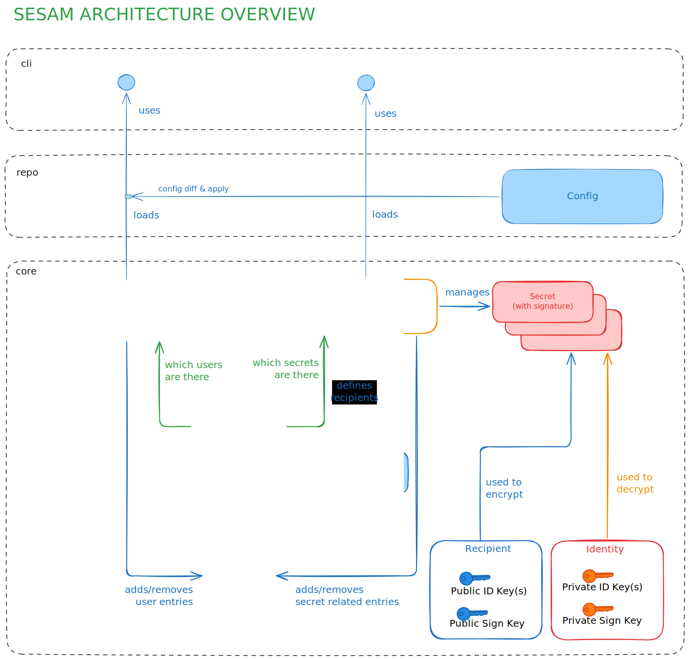

# Design

This document describes the general design ideas behind `sesam`.
Some familiarity is assumed, i.e. the other chapters of this manual
should have been read and ideally the reader also tried `sesam`.

## General ideas

- `git` integration is important, but still mostly decoupled. Everything can still be done via normal sesam commands.
- The concept behind git-crypt is nice, but fails in practice (files are either revealed or locked + git tooling)
- Concept of adding `.crypt` files along-side the actual files is very annoying in practice (like git-secret does)
- Where possible we re-use well regarded projects like SSH and age.
- Private key handling should be in the control of the user.

### Why `age` and `ssh`?

Most [existing tools](./alternatives.md) seem to rely on OpenGPG or symmetric keys for encryption. We never particularly enjoyed using PGP, although it is a feature-rich solution. In our experience it broke rather often and is really awkward to use for machine users.

`sesam` is mainly (but not exclusively) a tool from developers for developers.
Many developers are familiar with `ssh` as a daily driver of their work. Most people using GitHub or any other popular forges use it to authenticate themselves to the service. Meaning: They already have a key they could use for `sesam`. Also forges give us a big public key directory that we can use right away.

`ssh` itself is meant for networking; we were only interested in the
key concept. Luckily `age` exists, which not only supports `ssh` keys
for hybrid encryption but also provides a clean encryption format and
post-quantum keys.

Additionally `age` offers a full [plugin
system](https://github.com/FiloSottile/awesome-age#plugins), making extending
`sesam` with new ways of authenticating (e.g. FIDO keys) easier.

### Two state representations

`sesam` operates on two different views of the repository:

- `sesam.yml` - the *declared* state. Edited by humans.
  Describes who should be in which group and which secrets exist.
- The audit log under `.sesam/audit/log.jsonl` - the *verified* state.
  Append-only, signed, replayed to derive the actual current state.

`sesam apply` is the bridge between them: it diffs the two and proposes
audit-log entries to bring the verified state in line with the declared
state. Verification always operates on the audit log; the declared
state is treated as a request, never as truth. This is what makes the
*Invalid modified config* attack (see below) recoverable.

## Persistence

`sesam` will store all its data inside the `.sesam` directory. This directory may be in the
same directory as a `.git` folder or inside a sub-folder of a `git` repository.

```
sesam.yml
.gitattributes
.gitignore
.sesam
├── audit
│   ├── init
│   └── log.jsonl
├── links
│   └── https:__github.com_sahib.keys
├── objects
│   ├── some_folder
│   │   └── secret.sesam
│   └── README.md.sesam
├── signkeys
│   ├── user1.age
│   └── user2.age
└── tmp
```

## `sesam.yml`

The config file describing the should-be state.
Read more on the [Config](config_ref.md) page.

## `.gitignore`

Written on `sesam init`. Will by default block all files except the ones visible in the tree above.
This is to make sure that you do not commit revealed files by accident. If you have extra files
you want to commit then you can of course add them here.

## `.gitattributes`

Written on `sesam init`. Defines the `git` integration of `sesam`.

## `objects`

The files in the `objects` folder are named the same way as their revealed pendants, just under a different root (`.sesam/objects`).

The `.sesam` format is [age](https://github.com/C2SP/C2SP/blob/main/age.md) but with an added footer at the end.
The footer is limited to 4KB and is delimited by a newline. This makes obtaining an `age` compatible file easy:

```bash
$ head -n -1 .sesam/objects/secret.sesam > secret.age
```

The header contains this information encoded as a single JSON line:

```json
{
  "path": "README.md",
  "hash": "FiD+6bLnYpaa8RWQpfwrQKTVDZfFz17qAmfKjxdsFxOQcA==",
  "signature": "7aEDQNZXqGc4p593Nnxjq4ap3eOiriXe+oB/AOs5wW9AJVP45a4QPSk/tHfeXe2xT+z0NjmBX7BCR+a4ZSD1e9Ot4Qk=",
  "sealed_by": "alice"
}
```

- The hash used is `sha3-256`
- The signature used is `ed25519` using the sealer's signing key.

## `audit` log

### `init`

The `init` file is written once per `sesam init`. You may never modify it,
as we check if it was modified over the course of the git repo's lifetime.
It contains an UUID generated during `init`.

### `log.jsonl`

The encoding of the audit log. See [Audit log Specifics](#audit-log-specifics)
for the entry schema.

- First line is the base64 encoded, age-encrypted audit-key log.
- This first line will change when adding new users or removing existing ones.
- Every other line is a base64 encoded audit entry.
- Each entry is encoded as JSON and then encrypted with the symmetric key from line1 with `ChaCha20Poly1305`.
- Each entry's nonce is derived from its monotonic `seq_id`, so no key/nonce pair is ever reused.
- Anyone who can decrypt line 1 can decrypt the entire log. In practice
  this means every currently-active user. After a `kill`, the
  symmetric key is rotated and line 1 is rewritten - but a removed
  user who already pulled retains the ability to decrypt log entries
  up to the rotation point.

## `signkeys`

Each user possesses an Ed25519 signing key, generated during `sesam init` or
adding of that user. The private key part is stored in this directory under the
user's name. It is encrypted using `age`. Each signing key is only accessible
via the identity of that specific user.

```admonish note
Why separate signkeys? Because regular age keys do not allow signing, while ssh keys do.
To allow both (and possibly more in the future) we coupled the identity to a separately managed signing key.
```

A user who has been removed via `sesam kill` retains their old
`signkeys/<user>.age` file in git history, and can still recover the
private key with their identity. They can therefore still produce
ed25519 signatures with their old key. This is harmless because their
signing public key is no longer in the active state derived from the
audit log, so any signature they produce will be rejected at verify
time.

## `tmp`

We use our own `tmp` folder to make sure sensitive information is not stored
outside `.sesam`. This also gives us the guarantee (well, if the user is not
really doing weird stuff) that we're on the same partition, which makes
renaming files atomically easier.

## `links`

This is a cache for public keys we downloaded from git-forges or links.
It is mainly here to make sure link contents are not just changing out of nowhere.

## Cryptography


### Short facts

- Two kinds of keys: signing (ed25519) + identity/recipient (ssh or age)
- Hybrid encryption using `age` (X25519) and an additional signature.
- Audit log proving who added which user or secret at what time.
- Audit log is encrypted to avoid spilling too much information.
- Secrets are linked to the audit log by storing a *root hash*, built
  out of the individual hashes of all current secrets.
- Only admin users can add or remove users.
- Only users with access to a secret can give access to other users.

### Threat model

`sesam` protects against the following threats:


| Threat                                                        | In scope     | Mitigated by                                                  |
|---------------------------------------------------------------|--------------|---------------------------------------------------------------|
| Read-only attacker on the git remote                          | Yes          | age hybrid encryption of all files in `.sesam/objects`        |
| Repo-write collaborator self-elevating to admin               | Yes          | New audit entries must be signed by an admin already pinned   |
| Repo-write collaborator adding self to a secret's reveal list | Yes          | Same - must be signed by an existing recipient                |
| Repo-write collaborator pushing broken state (DoS)            | Partial      | `sesam verify` flags it, but the repo state is poisoned       |
| Audit log truncation / substitution                           | Yes          | Init-file pin + prefix check across git history (see below)   |
| Force-push that rewrites history                              | Out of scope | User must disable force-push at the forge                     |
| Compromise of forge public-key directory (e.g. github:user)   | Partial      | Cached in `.sesam/links/` (TOFU); manual exchange is safer    |
| Local machine compromise / identity-key extraction            | Out of scope | User responsibility                                           |
| Removed user reading secrets they previously had access to    | Out of scope | Requires explicit `rotate`; see Confidentiality section       |
| Social engineering of an admin (e.g. `sesam tell attacker`)   | Out of scope | -                                                             |


### Aspects

A cryptosystem needs to fulfill different aspects which we try to describe here.

#### Confidentiality - data is only disclosed to authorized parties

This is guaranteed by `age`. Only encrypted files in `.sesam/objects` are pushed.
Using hybrid encryption, only the recipients defined at seal time can
decrypt the file.

If a user is added we will re-encrypt the files to include the user accordingly
to all files he has access to. When removing a user we have to consider all secrets
known the user had access to. Future secrets will not include him/her as recipient,
but a rotation of secrets is required.

```admonish warning
Removing a user does **not** revoke access to secrets they could
previously read. Two reasons:

1. The encrypted ciphertexts they already pulled are still decryptable
   with their identity key, forever.
2. Past commits in git history still contain those ciphertexts encrypted
   to their old recipient.

To actually revoke access, follow `sesam kill` with `sesam rotate` for
every secret the user could read. This is a property of any
secret store - not unique to `sesam`.
```

#### Integrity - data is not modified in unauthorized ways

Both the audit log and the actual secret files have signatures attached to them.

The audit log's signatures are verified on most commands (seal, tell, kill, ...) but not all
(`sesam show` and `sesam smudge` for git integration and UI/UX purposes).

Full integrity check is being done on revealing the secrets or when doing `sesam verify --all`.

#### Availability - data/systems are accessible when needed

This can be split in two parts: Repository availability and Secret availability.

Since `sesam` is not a long running process, repository availability is mostly the same as in every
`git` repository. You can always clone a repo and retrieve the encrypted files in it as long the remote is available.

Secret availability means that we have to make the secrets available when needed (e.g. for deployments).
The stronger the verification is the more likely it is that deployments will fail to run because we found
something suspicious. As a user you can choose between fast reveals (more availability - just
`git pull` plus the smudge filter) and high integrity (additionally
running `sesam verify --all`, or using `sesam reveal --pull`).

The best solution of both worlds is to set up a job in CI that tells you when a
sesam repo does not verify correctly anymore and act accordingly before you go
to deployment.

#### Authenticity - the entity is who it claims to be

This is guaranteed by having an intact audit log. Every user has a public signing key that is
stored in the audit log when the user was created. All signatures made by this user can therefore
be verified to be authentic by all other users.

#### Non-repudiation - a party cannot later deny an action they took

The audit log is append-only by design. Replacement and truncation
are not prevented at the storage layer, but they are *detectable*:

- **Replacement** is caught because the init UUID and signature in
  `.sesam/audit/init` are pinned in the first commit and checked over
  git history.
- **Truncation** is caught by verifying that the audit log at each
  prior commit is a strict *prefix* of the log at the next - i.e. the
  log never shrinks across history.

*Caveat:* This only holds true when force pushes are not allowed or at least noticed.

#### Accountability - actions can be traced to a responsible party

Entries in the audit log have a user name attached to them.

#### Reliability - consistent intended behavior

Reliability here means crash-safety, not determinism. Given the same
inputs, `sesam seal` produces different ciphertext on purpose
(inherited from `age`). This makes it harder for a read-only attacker
to identify *which* secret changed between two commits.

On the other side we do the following things to stay reliable in case of crashes:

- We use atomic renames where possible to avoid half-written files and inconsistent state.
- We use file locking to avoid having several processes working on the repo.
- The audit log can detect logic failures.

TODO: Seal + rm secret is not transactional. If interrupted, verify will find that the root hash is wrong.

### Assumptions

We assume a few things about our environment that are hopefully not fully unreasonable:

- The git history is linear, i.e. we can detect if someone tampered with the audit log. This means `git push --force` may not be allowed. This can be easily disabled by most forges and is usually the better default for most use cases anyways.
- Users having write access to the repository have a certain level of trust. If malicious, they might not be able to read secrets, but it
  might be possible to cause outages by pushing broken secrets that make `sesam verify` or other commands complain.
- Some local operations (like viewing diffs or doing an checkout of old branches) do not require full verification on every step. We assume the user
  regularly runs `sesam verify --all` (e.g. during CI/CD) before doing anything serious like deployment.
- User identities are stored securely and are not shared between users.

### Attack vectors

In this section we collect attack vectors we are protecting users of `sesam` from.

#### Replacing secrets with attacker supplied content

Signatures protect the integrity of a secret, but what if the signature is replaced as well?

- If the attacker does not add an entry to the audit log, then we will notice because the `root_hash` changed.
- If the attacker tries to add an audit entry then he has no way to sign it if he is not already part of the repository.
- If the attacker is part of the repository but cannot access this specific secret then verification of the audit log will complain.
- If the attacker already had legitimate access to the secret then this is out of scope for `sesam`.

#### Self-add to reveal list or admin list

Similar, what stops an attacker from adding himself to the access list for a secret or make himself an admin?

For admins: Only admin users can add new users or change groups. A user might
be part of the repository and can therefore append an entry with valid
signature to the audit entry. However, the signature must be from an admin user
that was an admin already before that entry.

Similarly, users cannot add themselves to the access list for specific secrets.
We check that the user changing the access list had access to the secret
beforehand.

#### Audit log substitution or truncation

One could try to substitute all of the audit log to tell another story about the repository's state.
Alternatively, one could truncate the audit log to a state that is more favorable for the attacker.

There are two mechanisms that can detect such:

- The first entry of the log has a UUID which is stored separately in `.sesam/audit/init`.
  This file should never change over git history. We can verify this by asking git in how many
  commits it was modified - if it was more than one this gets flagged. During verify we compare the `init`
  UUID to the one stored in the audit log. If it differs it gets flagged as well.
  This test will only trigger if the complete log was substituted.
- A more thorough test is to check if the audit log is only growing. Since it's append only we would notice
  truncations by going back in history and seeing if each commit contains an audit log that is an prefix to
  the audit log in the commit afterwards. This test is too expensive to be run all the time but will also notice
  if the log was truncated.

#### Denial of Service via broken repo

Someone could do some of the things above unsuccessfully and still push it. The result might be a broken audit log or
secrets with wrong signatures or hash values. In any case, `sesam verify` will complain - which is the right thing to do here.
But this will also lead to secrets not being revealed. If `sesam` is part of a deployment pipeline we have to rely on the user
stopping the deployment and checking what's up before potentially deploying old secrets (causing trouble later on).

#### Invalid modified config

The audit log describes the current state of the repo, while the config (`sesam.yml`) describes the state the repository should have.
This could be hijacked though by an attacker pushing a modified config with the changes he or she would like to see and then convince or trick
another privileged user (e.g. an admin) to then call `sesam apply` to change the state accordingly. It is a rule therefore to allow for `sesam apply`
to only apply the changes if they are present as git diff in the current working directory. When the change came already committed, then
apply and verify will complain. There are situations where this could be valid though, which is why you can force apply to do it anyways.

### Possible improvements

- Limit each user to at most 2 keys, to avoid losing overview.
- Using forge-ids or links as public key input might have some transparency issues. We need to show the users clearly
  what user/public keys are coming in there. Document that transmitting via side channel is probably safer as we don't
  need to rely on forges like GitHub.
- Make seal atomic (or at least close to) - interrupting it might
  lead to a failed root hash check, since seal + rm of the previous
  secret is not currently transactional.

----

## Implementation

### Overview


<div style="text-align: center;">
  
</div>

### Other notes

- `sesam` should support several .sesam dirs per git repo, `.git` and `.sesam` don't need to be in the same folder.
- We use [multicode](https://github.com/sj14/multicode) to encode hashes, priv/pub keys and signatures in a self-describing way.

### Audit log Specifics

Append-only, hash-chained and signed log of all state-changing operations.
Stored under `.sesam/audit/log.jsonl`.

Entry structure:


| Field        | Description                                              |
|--------------|----------------------------------------------------------|
| `seq_id`     | Monotonic sequence number (starting at 1)                |
| `prev_hash`  | SHA3-256 (multihash-encoded) of the previous entry       |
| `operation`  | Operation type (see below)                               |
| `time`       | ISO8601 UTC timestamp                                    |
| `changed_by` | User that executed the operation                         |
| `detail`     | Operation-specific data (see below)                      |
| `signature`  | Ed25519 signature over all other fields (canonical JSON) |


Operation types:


| Operation        | Detail fields                                  | Notes                                           |
|------------------|------------------------------------------------|-------------------------------------------------|
| `init`           | InitUUID, Admin (embedded UserTell)            | Trust root. Pins first admin. See below.        |
| `user.tell`      | User, PubKeys, SignPubKeys, Groups             | Must be signed by an admin.                     |
| `user.kill`      | User                                           | Must not remove last user or last admin.        |
| `secret.change`  | RevealedPath, Groups                           | Add or update a secret and its access list.     |
| `secret.remove`  | RevealedPath                                   | Only users with access may remove.              |
| `seal`           | RootHash, FilesSealed                          | Hash over all sorted signatures.                |


Group membership is part of the `user.tell` detail. There are no separate
group operations. Admin status is determined by membership in the "admin" group.

```admonish note
We will likely have more entry types later, e.g. to re-key a user.
```

