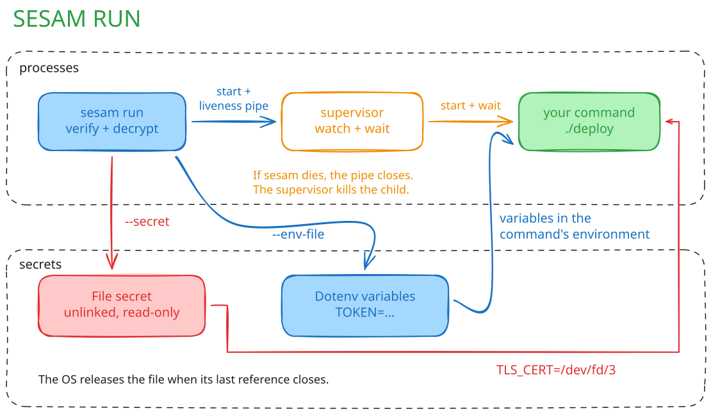
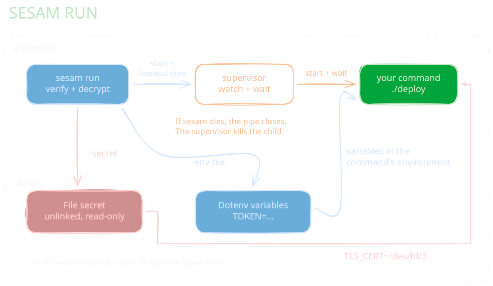

# Managing secrets

## Adding a secret via CLI (imperative)

```admonish note
All secrets must be in the same folder as `sesam.yml` or below it.
We do not support adding secrets outside of the sesam repository.
Attempts to do so will error out.
```

If you have a secret at `path/to/secret`, then having it managed by `sesam` is only a matter of this command:

```bash
sesam add path/to/secret --group deploy
```

This will:

1. Record that this file is now managed by `sesam` by adding it to the audit log.
2. Encrypt the file and place it in `.sesam/objects`. This is what is being pushed in the end.

If you omit the `--group` parameter then only the `admin` group will have access to the file.
You can change this at any point by just re-running the `add` command with any groups you want to set.

Overall the workflow looks like this:

```
      ┌─────────────────┐   git add   ┌─────────────────┐    seal     ┌─────────────────┐
      │  git objects    │◄────────────┤  sesam objects  │◄────────────┤ revealed files  │
      │  .git/objects   ├────────────►│ .sesam/objects  ├────────────►│ in worktree     │
      └─────────────────┘   checkout  └─────────────────┘   reveal    └─────────────────┘
```

What this means for you:

- The revealed files are ignored by git.
- Commands like `git log` will print paths like `.sesam/objects/secret.txt` but not `secret.txt`. This is because
  the actual revealed file is of course not tracked.
- If you want to run `git` commands explicitly on secrets, you have to run e.g. `git log .sesam/objects/secret.txt` not `git log secret.txt` therefore.

## Adding a secret via config (declarative)

```admonish warning
The `sesam apply` feature is not yet implemented.
Please see here to view the [plan](https://github.com/open-sesam/sesam/issues/62).

The documentation here is just a preview.
```

Adding secrets via CLI is nice for scripts. `sesam` also supports describing
the desired state in a declarative way via `sesam.yml`. If you executed the
above command you will notice the secret was added already to the config:

```yaml
secrets:
  - path: path/to/secret
    access: [deploy]
    desc: Where it used, who owns it, Contact...
```

If you did not run the `add` command above, then you can also add the entry manually and then run:

```bash
sesam apply
```

This will automatically check what the state is in the repo and how it differs
from the state in the config. The changes are then resolved by adding/removing
secrets or adding/removing users.

## Adding multiple secrets

You can also add whole directories, if you need to:

```bash
tree dir/of/secrets
.
├── some_file
└── sub
    └── another_file
sesam add --nested dir/of/secrets
tree dir/of/secrets
.
├── sesam.yml
├── some_file
└── sub
    ├── another_file
    └── sesam.yml
```

This will create a config hierarchy of `sesam.yml` files in the config:

```yaml
# Main sesam.yml:
secrets:
  - include: dir/of/secrets
```

```yaml
# dir/of/secrets sesam.yml:
secrets:
  - include: sub
  - path: some_file
```

```yaml
# sub sesam.yml:
secrets:
  - path: another_file
```

Once done you can also add descriptions to the files in the config or do more fine-tuning with the available [config keys](./config_ref.md).

```admonish note
If you ever create new files in the sub directories they do not automatically get added.
Instead you need to run `sesam add` again. This will also remove secrets that are not there anymore, if any.
In that sense, it works a bit like `git add`.
```

## Modifying secrets

Running `sesam add` will work here too, similar to `git add`. By default this will also re-seal the secrets,
except if you pass `--no-seal`.

If you want to change the access groups of a user, then just pass a different set of `--group / -g` flags.
Note that this will overwrite the existing groups. If you would rather like to append, then use `--group-add / -G`.

### Getting an overview

If you need to see which files were modified but not yet sealed you can use `sesam status`:

```bash
# with --all you will only see the modified files,
# without it only those that changed in some way.
sesam status --all
.
├─ M README.md (admin)
├─ ✓ bg.png (admin)
╰─ services/
   ├─ ✓ gateway.env (admin)
   ╰─ ✓ registry.env (admin)
  1 out of sync · 3 in sync

```

This will show you files you edited directly without calling `sesam add` on them.

## Running a command with secrets

Use `sesam run` to give a command access to selected secrets without revealing
them in your worktree:

```bash
sesam run \
  --secret TLS_CERT=certs/client.pem \
  --env-file deploy/production.env \
  -- ./deploy
```

- `--secret TLS_CERT=certs/client.pem` gives the command a read-only file and sets
  `TLS_CERT` to its path, such as `/dev/fd/3`. Have your program read that variable;
  it must keep the inherited file descriptor open to use the path.
- `--env-file deploy/production.env` adds the variables declared in that dotenv
  file to the command's environment. Sesam parses the file without shell expansion.

Both options select managed files and can be repeated. Sesam verifies the secrets
and your access before starting the command. It rejects conflicting variable
names, including names already set in your environment, and releases the
repository lock before the command starts.

<div style="text-align: center;">
  
  
</div>

Sesam waits for the command and returns its exit code, or `128 + signal` if a
signal terminates it. On Linux and macOS, sesam removes each temporary file's
name before writing secret bytes. The open file still works through `/dev/fd`;
the OS releases it when the last reference closes. If sesam receives `SIGKILL`,
its surviving supervisor kills and waits for the immediate child. This does not
cover the command's descendants.

## Removing secrets

If you have deleted files you can run this:

```bash
sesam rm files/ dir/
```

```admonish warning
Please do not delete secrets just with `rm`. This will just remove the revealed file, but the
sealed file in `.sesam/` will still exist. On the next `sesam open` it will suddenly be back.
```

## Moving secrets

Probably not very surprising by now, but we have a `mv` command as well:

```bash
sesam mv old_name new_name
```

```admonish warning
The same warning as with `sesam rm` applies: Please do not just move the file
with `mv`. This will just move  the revealed file to a new name, but the sealed
file in `.sesam/` will still exist. On the next `sesam open` it will suddenly
be back with the old path.
```

## Listing secrets

```bash
sesam ls
├── README.sesam
└── dir
    └── of
        └── secrets
            ├── some_file
            └── sub
                └── another_file
```

You can also use the ``--json`` switch to print it in a more scriptable way.
