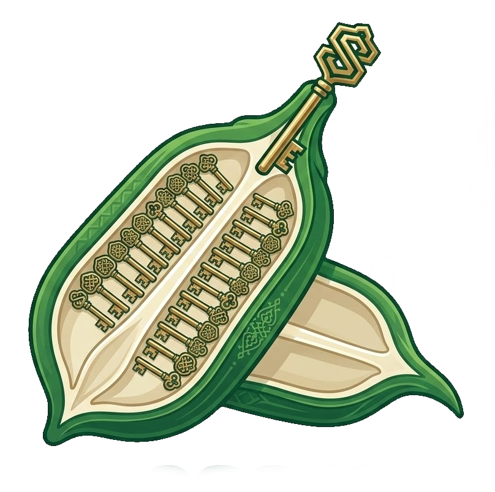

# What is Sesam?

<div style="text-align: center;">
  
</div>

**`sesam` is a tool for managing secrets in git.**

Three words, each of them doing some work:

- `secrets`: Are just regular files that contain something precious to you. They are on your filesystem *revealed* (decrypted) and *sealed* (encrypted).
- `managing`: Making sure *sealed* and *revealed* are in sync and allow the user to define who has access to what secret.
- `in git`: Developers are naturally used to `git` and `sesam` integrates well with it.

## Intro

Software projects often need to store and load several secrets such as
database passwords, certificates, API keys or other credentials. Those secrets
should be stored encrypted and only be accessible to the users that actually
need them.

`sesam` allows leveled access with multiple users to those encrypted secrets
and gives you a simple interface to manage both users and secrets.

In short, `sesam` fits well the [GitOps model](https://about.gitlab.com/topics/gitops/) of infrastructure.

```admonish note
The term *user* does not necessarily refer to a person. A user can also be a machine, like a server where `sesam` is installed.
```

### What is a secret manager?

You might think of a password manager now, which is not too far off - `sesam`
can indeed also be used as a password manager. A password manager is usually
targeted at managing individual secrets, while a secret manager is focused on
sharing selected secrets with other users in a team and machines. If you
already know what a secret manager is then you might be interested in [Why we
built another tool](./alternatives.md).

## Features

### Security

- Every write is recorded, signed and verified by an audit log.
- Support for SSH keys, age keys and age plugin identities.
- Different access levels through user groups.
- Encrypted at rest; only secret paths and group membership are visible in the repo.
- Safe to use (hard to accidentally push unencrypted secrets)
- Per-secret integrity checks with root-hash verification.

### Convenience

- Forge recipient shortcuts for GitHub, GitLab and Codeberg.
- Both declarative (config) and imperative (CLI) workflows possible.
- Familiarity to `git` users.
- Decentralized & offline ready.
- Scriptable via CLI interface.
- Somewhat fast encryption and decryption.¹
- Almost zero dependencies.

<small>
¹ <i>somewhat fast</i> is the new <i>🚀 blazingly fast 🚀</i> - benchmarks will follow later.
</small>

### Git Integration

- Secrets are naturally versioned.
- Allows viewing local diffs of secrets and the audit log.
- Hooks keep revealed files in sync on checkout, pull and merge.
- Merging of secrets is supported.

### Planned features

- Support for rotation and swapping of secrets ([Plan](https://github.com/open-sesam/sesam/issues/40))
- More tooling so that `sesam` can be well used as password manager.
- Deeper support for `env` files.

## Who is it for?

- Open source developers wanting to store secrets in their repos and give only their co-developers access.
- Small to mid-sized teams wanting to have different access levels in their secrets.
- Individuals wanting to store secrets in their git repos, even if it's just a single user.
- Machine users that need a scriptable tool.

## Learning

How to use this manual:

- Go to [Installation](./installation.md) to grab your copy of `sesam`.
- Go to [Basic Usage](./secret.md) to walk through what it can do.
- Go to [Advanced Usage](./template.md) if you need some more depth.
- Go to [Reference](./config_ref.md) if you need to look up things later on.

## The name

It is a reference to [Ali Baba and the Forty Thieves](https://en.wikipedia.org/wiki/Ali_Baba_and_the_Forty_Thieves)
out of the story collection [One Thousand and One Nights](https://en.wikipedia.org/wiki/One_Thousand_and_One_Nights).
In this story the cave opens upon calling the passphrase *"Open, Sesam!"* revealing a hidden cave full of gold and treasures.

You see this scene depicted on the [landing page](https://opensesam.org/).

The logo is a sesame pod, with the seeds replaced by cute little keys.
